# Manipulations pratiques sur VM Windows
  
## Gestion des utilisateurs
  
### Q.1.1.1 création de l'utilisateur Lionel Lemarchand
  
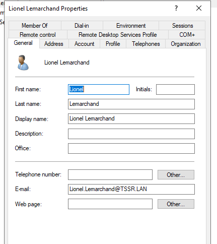  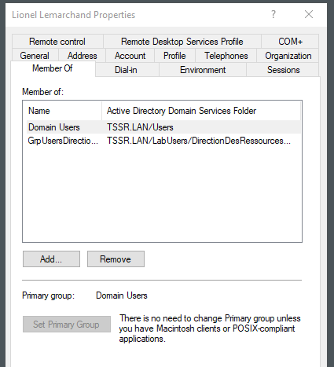
  
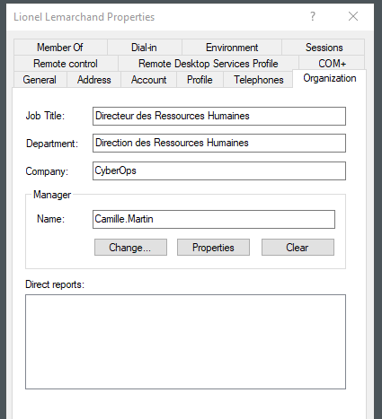 
  
  
### Q.1.1.2 création OU DeactivatedUsers
  
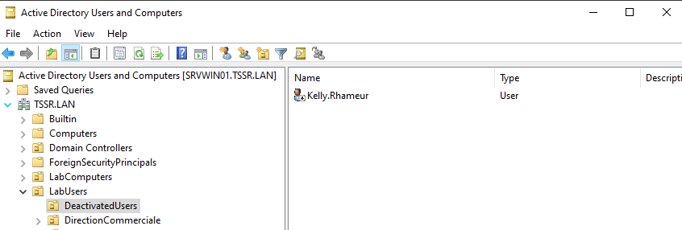
  
  
### Q.1.1.3 modification groupe de l'OU Direction Ressources Humaines
  
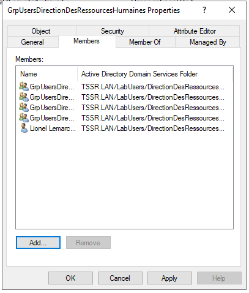
  
  
### Q.1.1.4 création dossier utilisateur et archivage du dossier du précédent utilisateur
  
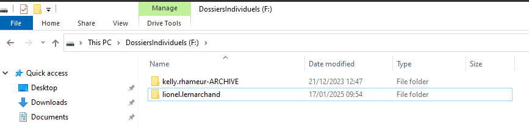
  
  
## Restriction utilisateurs
  
### Q.1.2.1 limitation horaire de connexion Gabriel Ghul
  
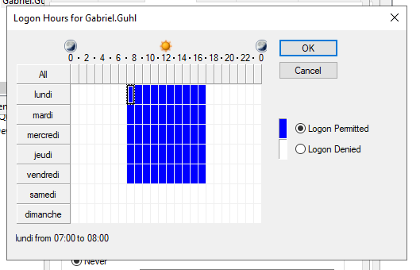
  
  
### Q.1.2.2 Restriction de connexion CLIENT01
  
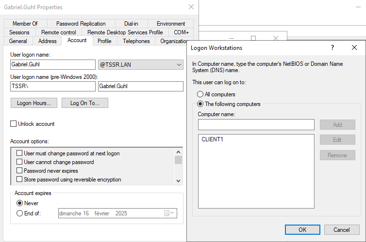
  
### Q.1.2.3 Stratégie de mots de passe
  
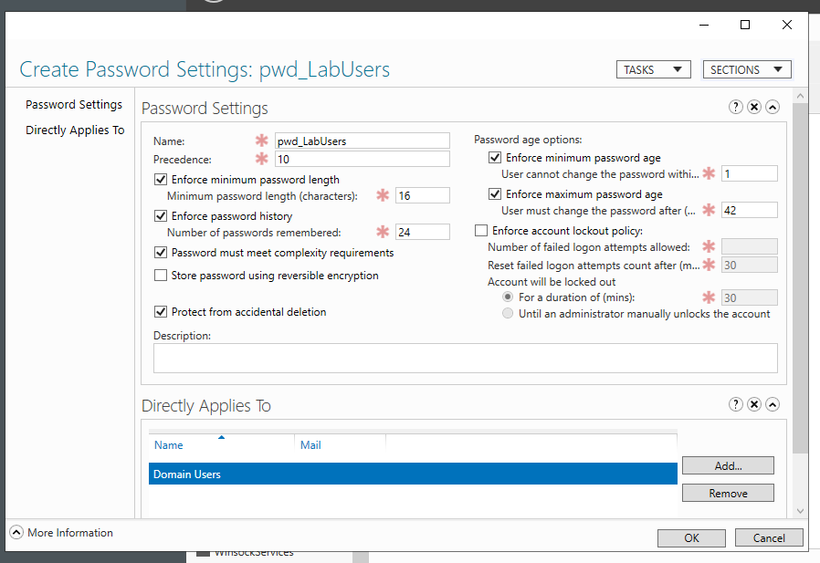
  
  
## Lecteur réseaux
  
### Q.1.3.1 GPO de mapage
  
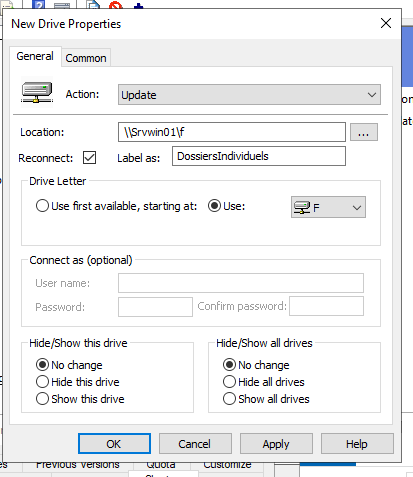  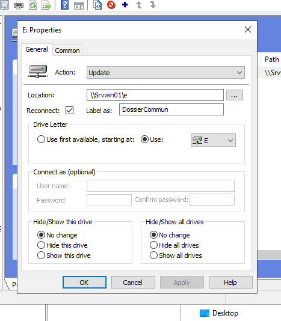
  
  
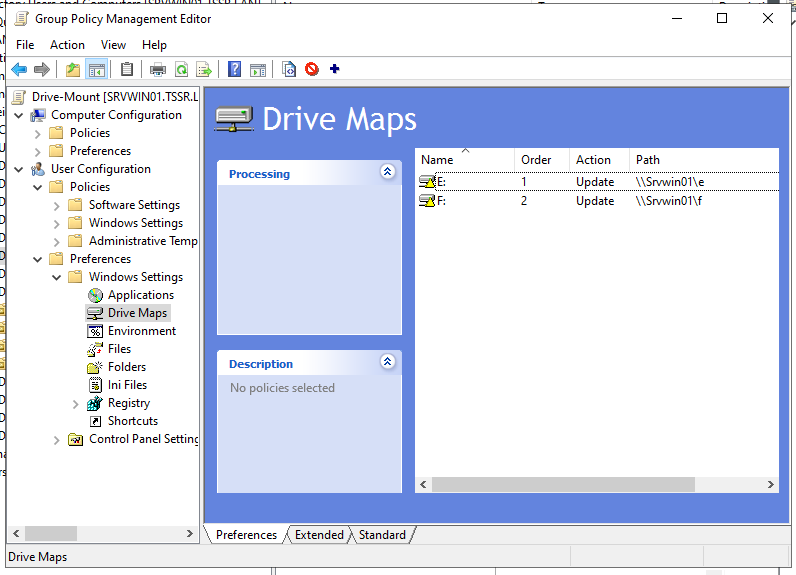
  
  
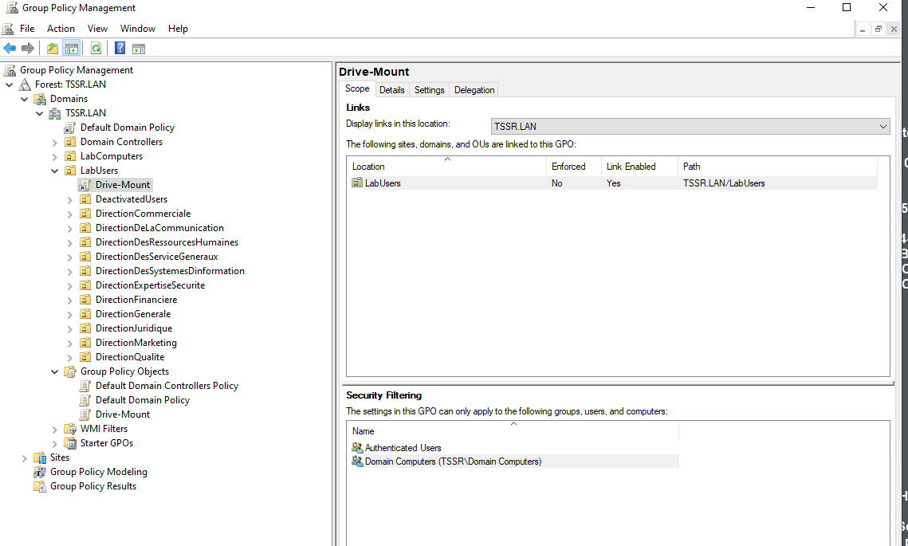
