# Manipulations pratiques sur VM Linux 
  
##  1 Gestion des utilisateurs
  
### Q.2.1.1 Création compte usage personnel
  
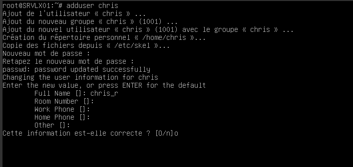
  
### Q.2.1.2 Recommandation:
 Il est recommandé d'utiliser un mot de passe fort, et de limiter l'accès au seul ressources utiles à l'utilisateur (application du moindre privilège), donc ne pas intégrer au groupe sudo.
  
  
## 2 Configuration SSH 
  
### Q.2.2.1 Désactivation de l'accès à distance de l'utilisateur root
  
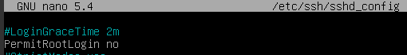
  
  
### Q.2.2.2 Limiter accès ssh compte personnel 
  
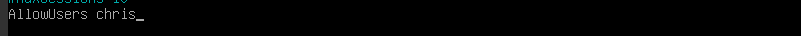
  
### Q.2.2.3 Authentification par clé
  
Interdiction de connexion par mot de passe
  
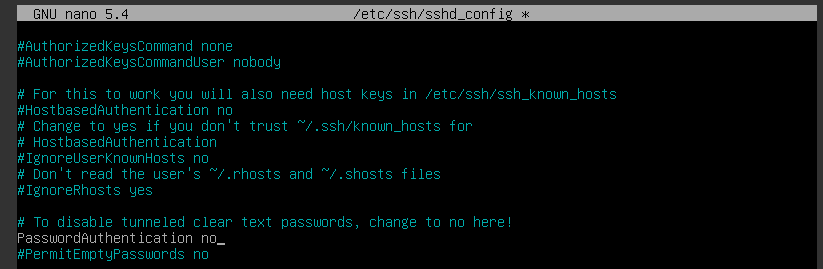
  
Génération de la paire de clés
  
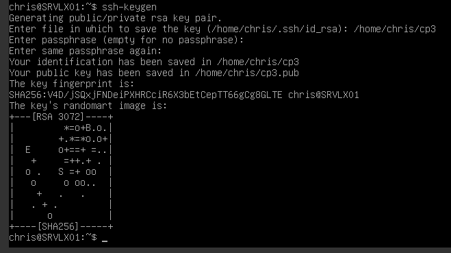
  
Configuration ssh par clé de chiffrement 
  
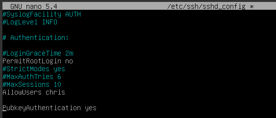
  

## 3 Analyse du stockage
  
### Q.2.3.1 Les système de fichier 
  
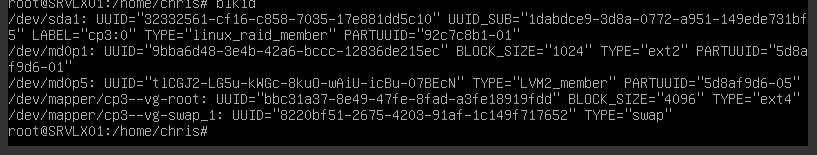
  
on peut observer que les types de système de fichiers présent sont:
- ext2
- ext4
- swap
   
### Q.2.3.2 type de système de stockage
  
Sur le serveur on trouve un stockage de type RAID (Redundant Array of Independent Disks) et LVM (Logical volume management).
   
### Q.2.3.3 Réparation RAID 
  
Ajout disque 8G
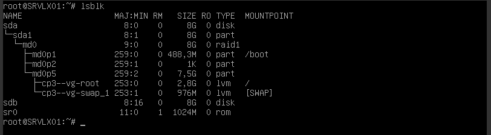
  
Réparation du RAID
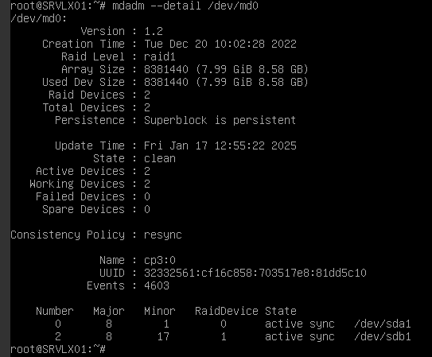
  
### Q.2.3.4 Ajout d'un nouveau volume logique
  
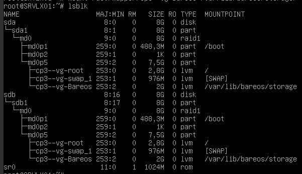
  
Modification de /etc/fstab pour automatiser le montage au démarrage
  
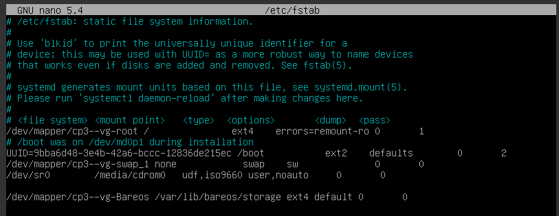
  
  
### Q.2.3.5 Espace disponible dans le groupe de volume
Il reste 1.79GiB de libre sur le groupe de volume
  
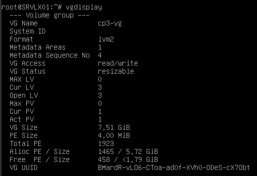
  
## 4 Sauvegarde
  
Composant de Bareos:
  
- bareos-dir: 
Pour Bareos Director qui est le composant responsable de la planification, du contrôle et du lancement des taches de sauvegardes. Il est installé sur le serveur en charge de la  gestion des sauvegardes et controle les autres composants.
  
- bareos-sd: 
Pour Bareos Storage daemon, est installé sur la ou les machines qui opèrent l'enregistrement des données sur un support de stockage. Il est mis en relation avec le file deamon par l'intermédiaire du Director.
  
- bareos-fd: 
Pour Bareos File Daemon, ce composant de Bareos est en charge de la collecte des données à sauvegarder pour les envoyer au Storage Daemon. Il doit être installé sur chaque machine devant sauvegarder des données
  
  
## 5 Filtrage et analyse réseau
  
### Q.2.5.1 Règles actuellement appliquées sur Netfilter:
  
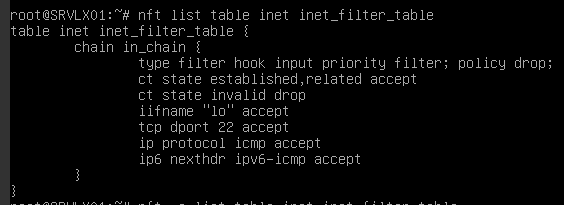
  
### Q.2.5.2 Types de communications autorisées sont:
  
Les communications autorisées sont les paquets ICMP IPv4 et IPv6 entrant, la connexion entrante en SSH sur le port 22, le trafic de la boucle local, le trafic entrant des connexions TCP déjà établies ou liées à une connexion existante. 
  
### Q.2.5.3 Types de communication interdites ?
  
Par défaut tout les trafics qui ne sont pas cité dans la réponse précédente sont bloqués. On peux voir dans les règles une précision supplémentaire concernant les paquets provenant de connexions TCP déjà établies et avec un état INVALIDE qui sont spécifiquement bloqués.
  
### Q.2.5.4 Ajout des règles pour autoriser Bareos à communiquer avec les clients bareos:
la règle ajouté pour permettre le trafic sur le réseau local de bareos porte le "handle 11"
  
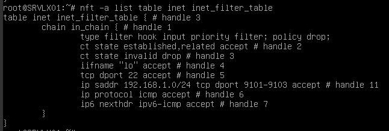
  
## 6 Analyse de logs
    
### Q.2.6.1 Liste des échecs de connections :
  
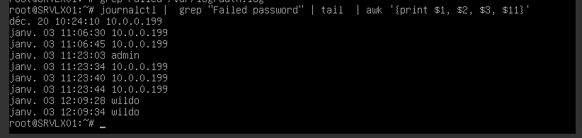 
  

